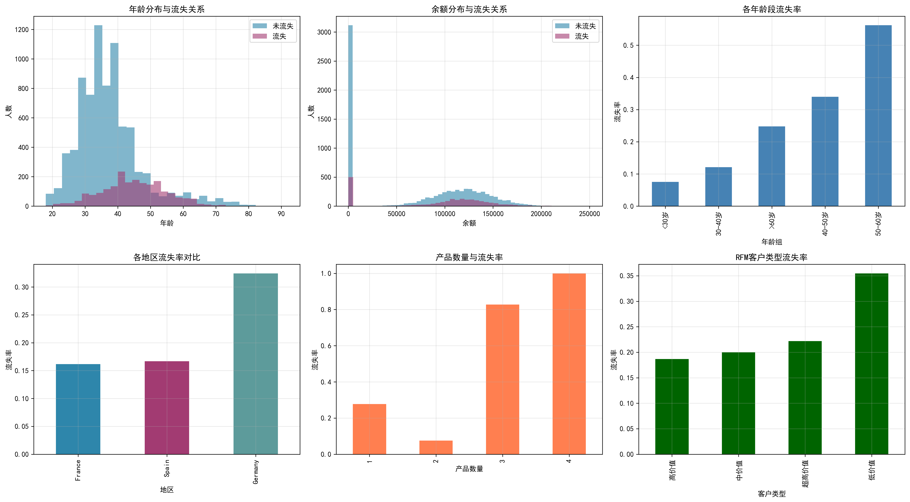
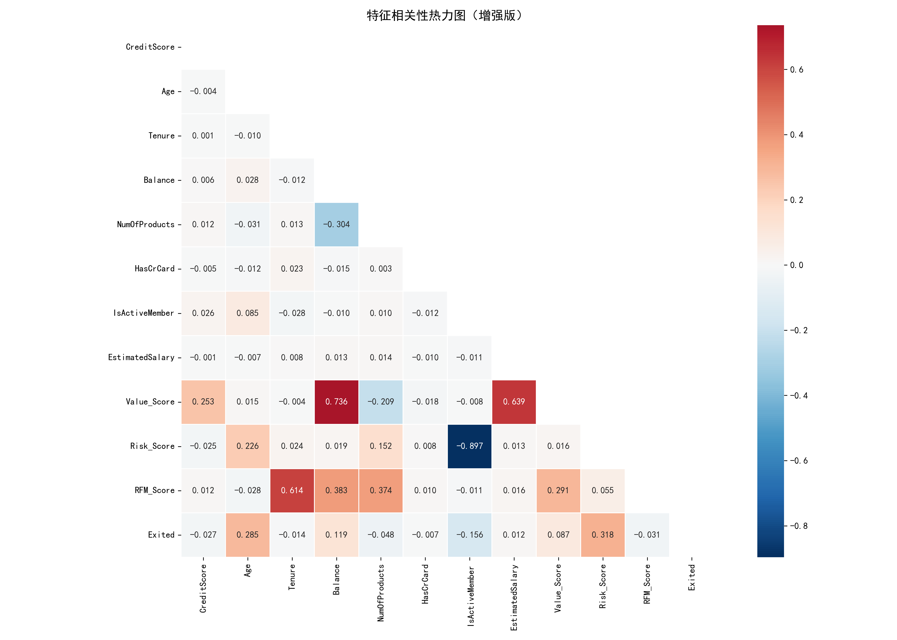
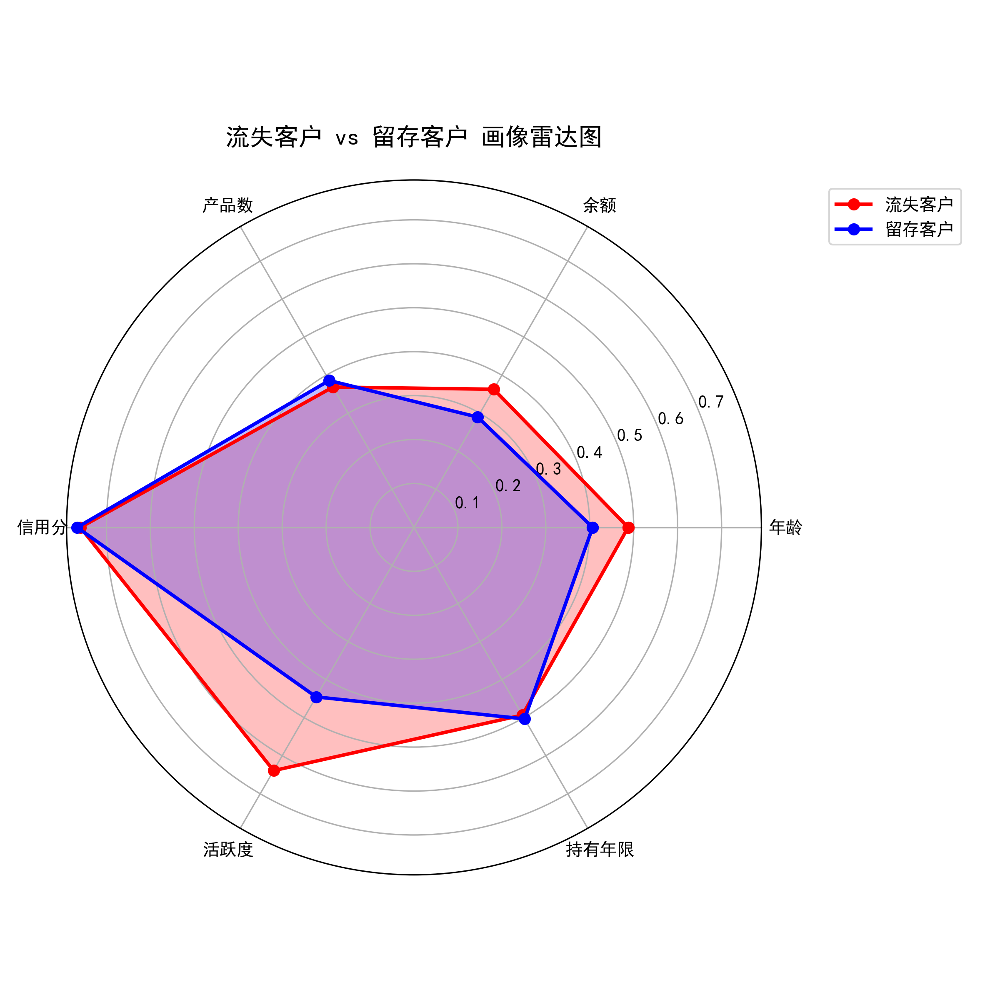
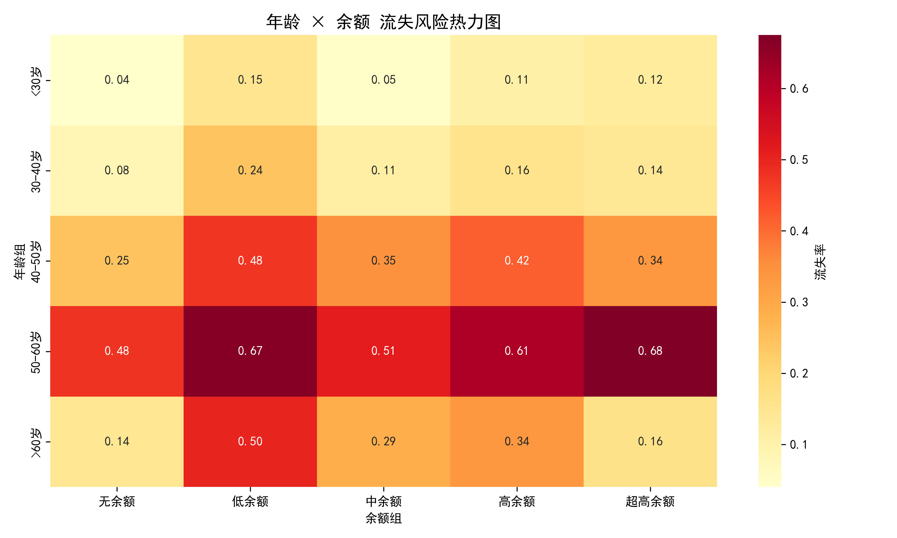
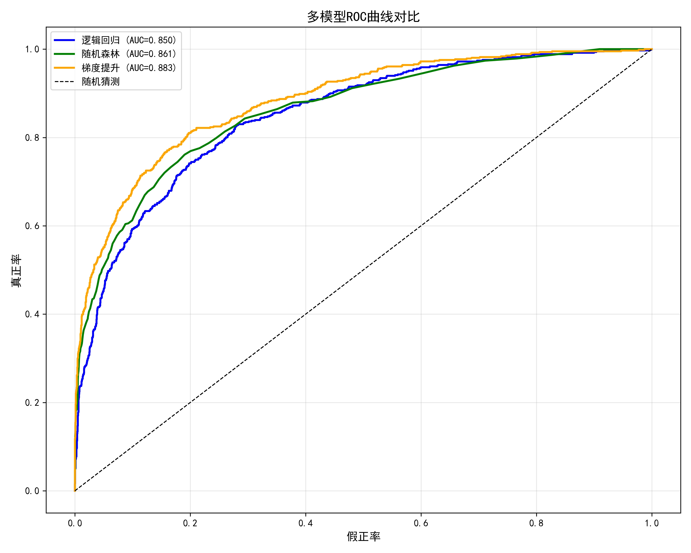
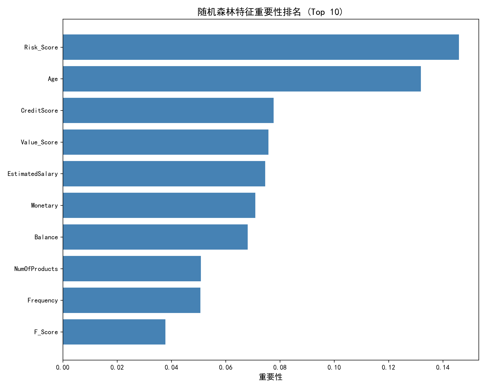

# 📊 Customer Churn Analysis & Prediction Project

客户流失分析与预测项目

本项目通过数据分析 + 机器学习模型，对银行客户流失（Churn）进行分析与预测，并从客户画像、特征关系、流失风险等多个角度进行可视化分析。

项目目标：

* 分析影响客户流失的关键因素
* 构建客户流失预测模型
* 提供可解释的业务洞察

# 🧠 项目内容

本项目主要包含三个部分：

1. 数据探索分析（EDA）
2. 客户行为与流失特征分析
3. 机器学习预测模型


# 📈 数据可视化

## 1. 客户基础特征分析

分析年龄、余额、地区、产品数量等因素与客户流失的关系。

主要发现：

* 年龄越大，流失率越高
* 产品数量过多反而可能增加流失风险
* 不同国家的客户流失率存在差异




## 2. 特征相关性分析

使用相关性热力图分析各特征之间的关系。

关键发现：

* Balance 与 Value Score 相关性较高
* Risk Score 与活跃度存在明显关系
* Age 与流失存在一定相关性




## 3. 客户画像对比（流失 vs 留存）

通过雷达图对比两类客户特征：

* 年龄
* 余额
* 产品数
* 信用分
* 活跃度
* 持有年限



主要结论：

* 流失客户平均年龄更高
* 活跃度更低
* 账户余额更高但使用率更低

## 4. 流失风险分析

结合年龄 + 余额构建流失风险热力图。



结论：

* 高年龄 + 高余额客户流失风险最高
* 中年客户流失率上升明显


# 🤖 机器学习模型

本项目对比了三种模型：

* Logistic Regression（逻辑回归）
* Random Forest（随机森林）
* Gradient Boosting（梯度提升）

模型效果对比：

| 模型                  | AUC       |
| ------------------- | --------- |
| Logistic Regression | 0.850     |
| Random Forest       | 0.861     |
| Gradient Boosting   | **0.883** |

ROC曲线对比：



最终表现最好的模型是：

👉 Gradient Boosting


# 🔍 特征重要性分析

使用随机森林分析重要特征：

Top 关键因素：

1. Risk Score
2. Age
3. Credit Score
4. Value Score
5. Salary
6. Balance



说明：
客户风险评分和年龄是影响客户流失最重要的因素。


# 🛠 技术栈

Python
Pandas
NumPy
Matplotlib
Seaborn
Scikit-learn

机器学习算法：

* Logistic Regression
* Random Forest
* Gradient Boosting


# 📂 项目结构

```
Customer-Churn-Analysis
│
├── data
│
├── notebooks
│
├── images
│   ├── 深度流失分析.png
│   ├── 相关性热力图.png
│   ├── 客户画像雷达图.png
│   ├── 流失风险热力图.png
│   ├── ROC对比.png
│   └── 特征重要性.png
│
├── churn_analysis.py
└── README.md
```


# 🚀 如何运行项目

安装依赖：

```bash
pip install pandas numpy matplotlib seaborn scikit-learn
```

运行项目：

```bash
python demo.py
```


# 📊 项目价值

这个项目可以用于：

* 数据分析作品集
* 数据科学项目展示
* 客户流失预测案例
* 机器学习实战项目
