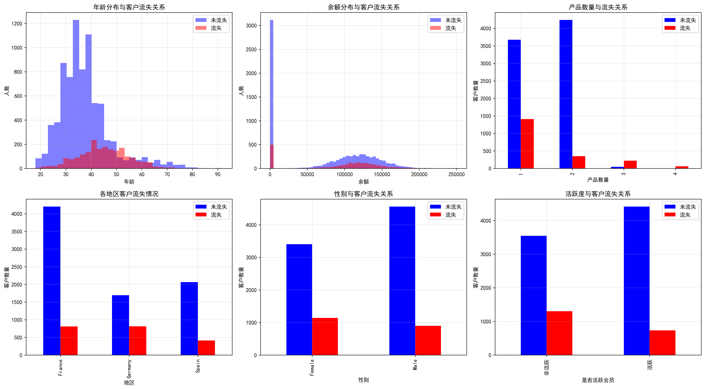
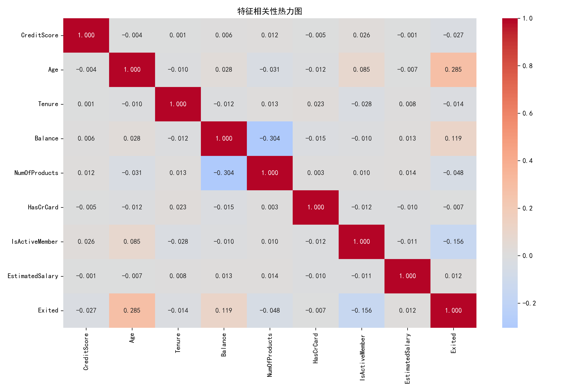
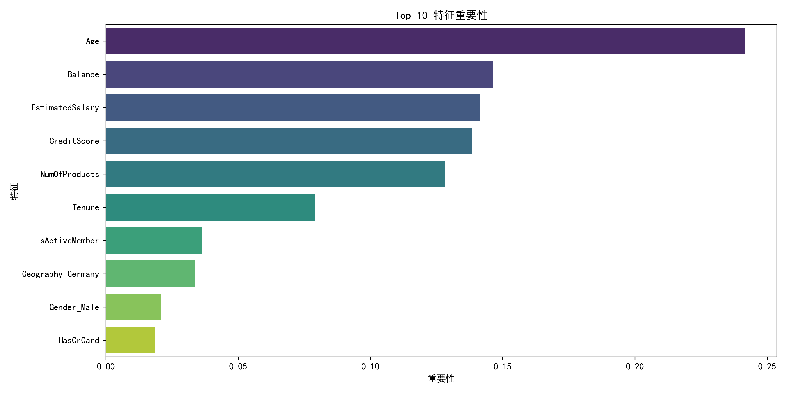
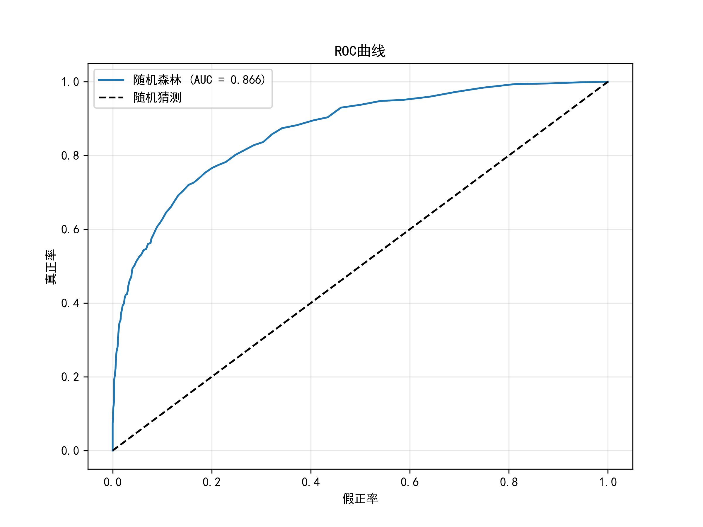

# -bank-customer-churn-analysis
 银行客户流失预测分析项目 - 使用Python进行数据分析和机器学习
# 银行客户流失预测分析项目

## 📊 项目简介
使用Python对银行客户数据进行探索性数据分析(EDA)和机器学习建模，预测客户流失风险，为银行提供业务决策支持。

## 📁 数据集
- 来源：Kaggle Bank Customer Churn Dataset
- 数据量：10,000条客户记录，14个特征
- 特征包括：信用评分、地区、性别、年龄、 tenure、余额、产品数量、信用卡持有情况、活跃会员、预计薪资等

## 🔍 分析内容
1. **数据探索性分析(EDA)** - 查看数据分布、缺失值、统计描述
2. **客户画像分析** - 对比流失客户与非流失客户的特征差异
3. **数据可视化** - 6个关键图表展示影响因素
4. **相关性分析** - 找出与客户流失最相关的特征
5. **客户价值分层** - 按余额分层分析流失率
6. **机器学习建模** - 随机森林模型预测客户流失
7. **特征重要性** - 识别最重要的预测因素
8. **业务建议** - 基于数据给出 actionable insights

## 📈 主要发现
- **总体流失率**: 20.37%
- **最易流失客户特征**:
  - 平均年龄: 45.1岁 (非流失客户: 38.8岁)
  - 平均余额: 91,148.54元 (非流失客户: 72,745.42元)
  - 平均信用评分: 645.3 (非流失客户: 651.9)
- **最重要的预测因素**: 年龄、活跃度、余额
- **模型表现**: 准确率 86.3%，AUC分数 0.85

## 💡 业务建议
1. 重点关注45岁以上的中年客户群体
2. 对高余额客户(>10万)加强维护和关怀
3. 提升会员活跃度可显著降低流失率
4. 德国地区客户流失率较高，需要针对性策略
5. 女性客户流失率略高，可考虑个性化服务

## 🛠️ 技术栈
- Python 3.8+
- Pandas - 数据处理
- NumPy - 数值计算
- Matplotlib/Seaborn - 数据可视化
- Scikit-learn - 机器学习建模

## 📊 可视化图表

*图1：各因素与客户流失关系分析*


*图2：特征相关性热力图*


*图3：Top 10 特征重要性*


*图4：模型ROC曲线*

## 📦 安装依赖
```bash
pip install -r requirements.txt
